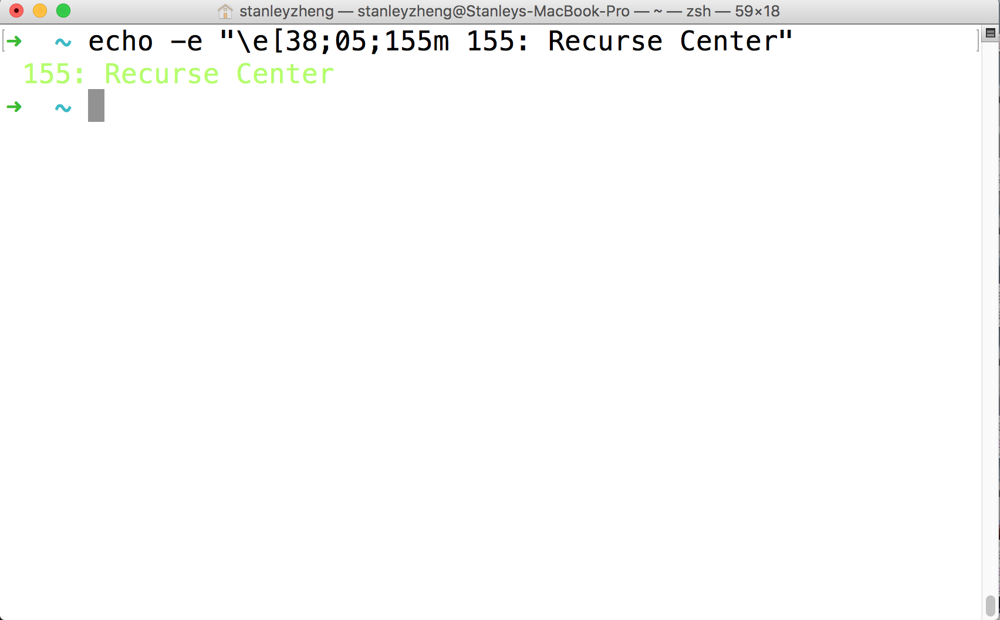
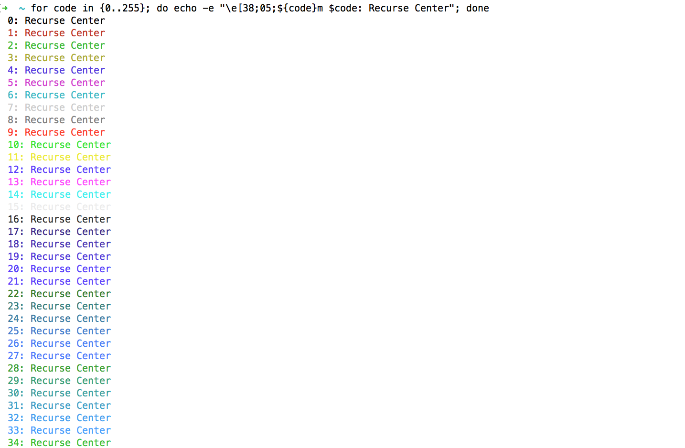
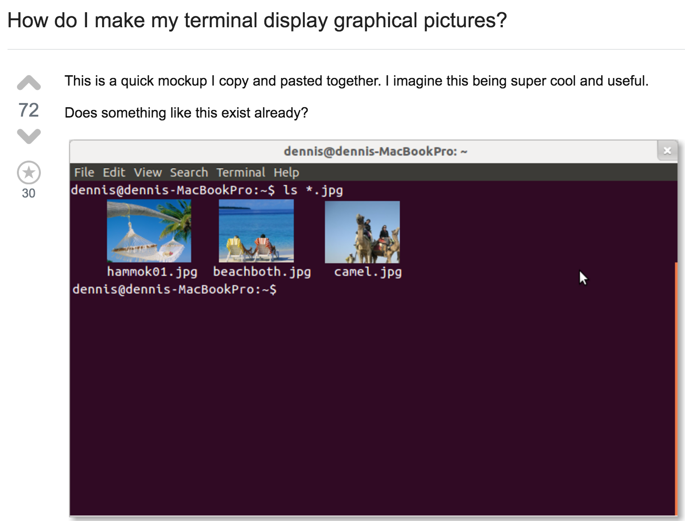

---

# Terminal Colors


## Stanley Zheng


---

# In the Beginning 

There were Mainframes.

Then ...

* Teleprinters (TTY)  
* Computer Terminals 
* **Terminal Emulators**
    - DOS
    - X Windows System (X11)

---

# Fast Forward

---

# This is your terminal

{.background}
* Its a Terminal Emulator
* *It has 80x24 lines*
* It supports 256 colors 
---


# Show me some Colors! {.big}

---
# A CMD 

```bash
echo -e "\e[38;05;155m 155: Recurse Center" 
```

---

# ANSI-encoded control sequences
- Escape Character Code explain this  
- echo -e "\e[38;05;155m 155: Recurse Center" 
{.background}

---

# Echo All the colors 
- for code in {0..255}; do echo -e "\e[38;05;${code}m $code: Recurse Center"; done 
{.background}

---


# Do Something Cool {.big}

---


# 🖼🐈 {.big}

---


# ImageCat {.big}

---

# Screenshot on StackOverFlow 
- Print an image 
{.background}

---


# Show me the Code! {.big}

---

# OK I lied

There was code I Promised 

* imagecat umbrella term 
* C implementation
* PERL implementation
* Bash Iterm2 Implementation

---
# Pseudo Code What It Does 

```javascript
// Read In Pixels of Image  
// Reverse find Closest Color
// Echos the Color 

---

# imgcat Perl 

@[youtube](sESMYVeJhKA)

--- 

# Wait this is not what we Imagined {.big}

---

# Iterm2 to the Rescue {.big}

---

# ANSI-encoded control sequences
- Escape Character Code explain this  
- echo -e "\e[38;05;155m 155: Recurse Center" 
{.background}

---


# How does that Work? {.big}

---

# Slides can have background images

{.background}

---
# Iterm2 ImageCat

```bash
function print_image() {
    print_osc
    printf '1337;File='
    if [[ -n "$1" ]]; then
      printf 'name='`printf "%s" "$1" | base64`";"
    fi

    VERSION=$(base64 --version 2>&1)
    if [[ "$VERSION" =~ fourmilab ]]; then
      BASE64ARG=-d
    elif [[ "$VERSION" =~ GNU ]]; then
      BASE64ARG=-di
    else
      BASE64ARG=-D
    fi

    printf "%s" "$3" | base64 $BASE64ARG | wc -c | awk '{printf "size=%d",$1}'
    printf ";inline=$2"
    printf ":"
    printf "%s" "$3"
    print_st
    printf '\n'
    if [[ -n "$4" ]]; then
      echo $1
    fi
}
```

---
# Iterm2 ImageCat

```bash
printf "%s" "$3" | base64 $BASE64ARG | wc -c | awk '{printf "size=%d",$1}'
```
---

# Thank You


---

